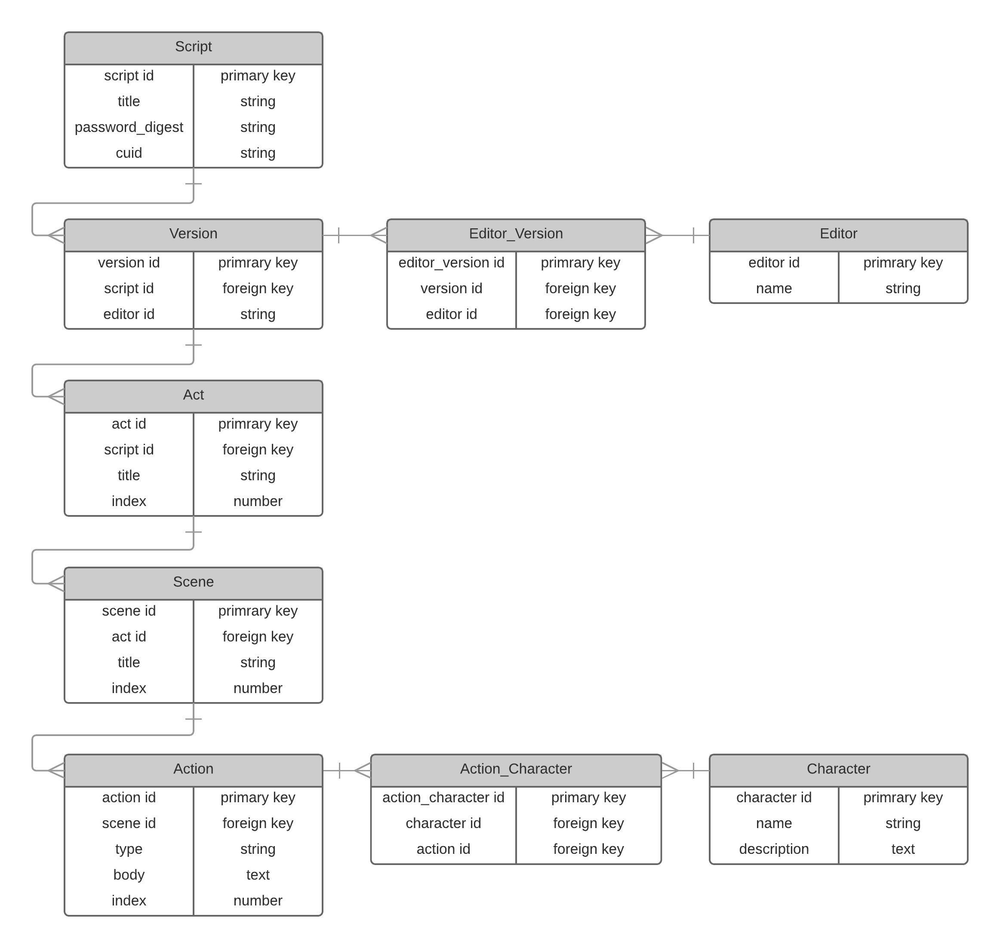
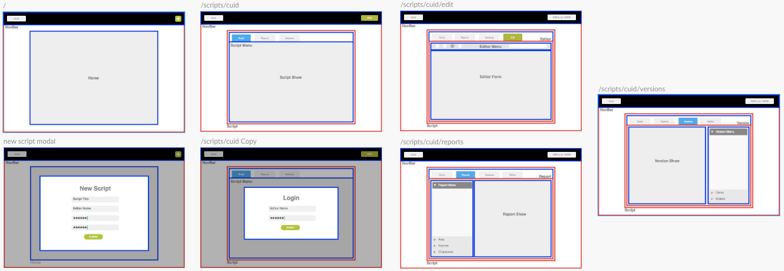
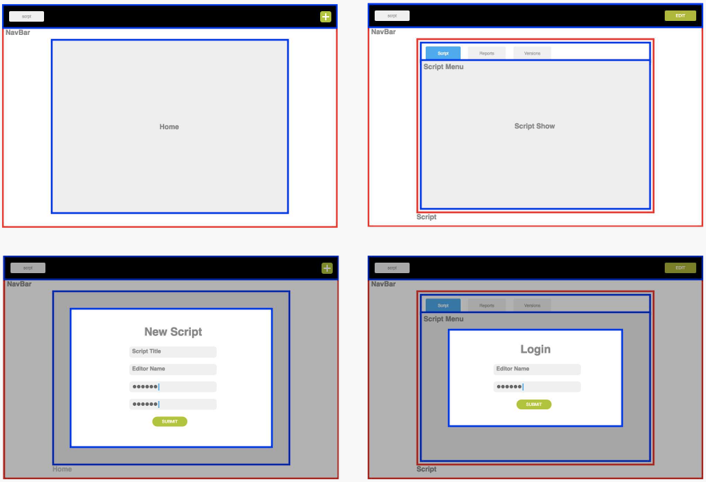
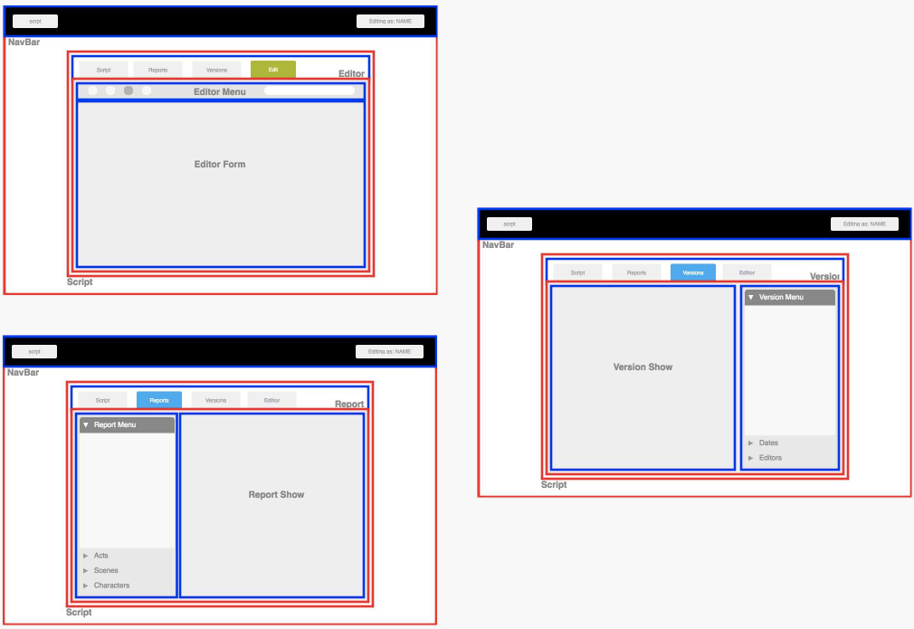

# _scrpt_

A playwriting portal with in-editor styling, version control, and filterable PDF generation.

You can find a live demo [here](https://scrpt.herokuapp.com).

## User Story

As a reader, I want:

* To view a script when provided with a url
* To filter the script by act(s), scene(s), or character(s)
* To see old versions of the script and compare them to the current version

As a writer, I want:

* To create a script that can be viewed by anyone with the  url, but can only be edited if they have the password
* To write scripts without having to worry about styling, so that I can focus on the content rather than formatting
* To simultaneously work on one document with other collaborators
* To be able to revert back to older versions of the script


## Entity Relationship Diagram



## Wireframes










## Frameworks and Libraries

#### Client

* React
  * React DOM
  * React Router DOM
  * Semantic UI
  * Formsy
* Redux
  * React-Redux
* Cuid
* Draft.js
* PDFMake


#### Server

* Ruby on Rails
* PostgreSQL

## Store State

```javascript
state = {
  Auth: {
    [cuid]: editor object {
      id: integer,
      name: string,
    },
    error: string
  },
  Edit: {
    editorState: object
  },
  Script: {
    error: string,
    script: {
      cuid: string,
      id: integer,
      title: string,
      editors: [ editor objects ],
      versions: [ version objects ]
    }
  },
  Report: {
    id: integer,
    filters: {
      acts: [ act objects {
        title: string,
        scenes: [ scene objects {
          title: string,
          show: boolean
        }],
        show: boolean
      }],
      characters: {
        [name]: boolean
      }
    },
    url: string
  }
  Version: {
    active: integer,
    version: version object {
      created_at: date,
      contentState: string,
      id: integer,
      editors: [ editor objects ],
      url: string
    }
  }
}
```
